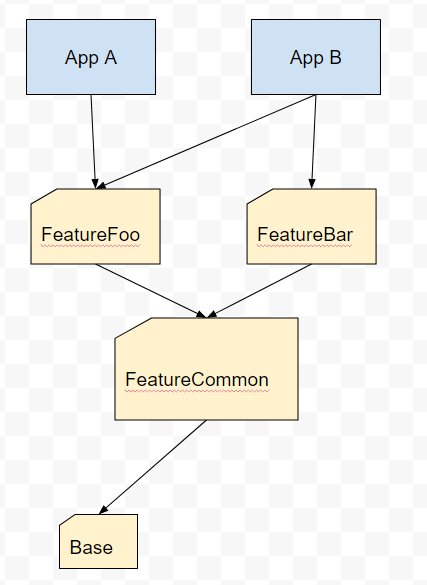

# A "simple" approach for modularizing Android projects with Dagger
(by Betclic devs)

## Goals of the approach:
- Libs should be providing classes and define their own dependencies
- Every dependency of a lib should be easily replaceable
- Reduce Dagger usage to reduce build time when possible (Dagger relies on annotation processing, massively increasing build time)
- Simplify scoping: skip memory optimization (for now), focus on @Singleton or unscoped (instance created on demand)

## Architecture of this sample:

# Patterns

## Define WHERE to inject (Injector + InjectorProvider)
*Idea: the 'final app' Component will implement some interfaces so Dagger will generate all inject methods in the app and not in libs* 

    interface FooInjector {
        fun inject(fragment: FooFragment)
        fun inject(activity: FooActivity)
    }
    
*Idea: to retrieve the right Injector, we need a rally point to get the app component, so the custom Application class will implement InjectorProvider*
   
    interface FooInjectorProvider {
        fun fooInjector(): FooInjector
    }

*Idea: to simplify injection, provides extension functions where you will use field injection (Android classes)*

    fun Fragment.fooInjector() = (this.activity?.application as FooInjectorProvider?)?.fooInjector()
        ?: error("Cannot inject without a proper reference to the application")
        
And in your Fragments

    fooInjector().inject(this)
        
(Maybe not necessary if you use DaggerAndroid. Could even be reduced to a single method call if you prefer.)
 
 
## Define WHAT to inject (Module as interface)
A library providing Activity/Fragment/View have to define its dependencies.
*Idea: provides an interface that looks like a Module*

    interface FooModule {
        fun providesBaseService(): BaseService
    }

(Maybe pick another name to avoid misunderstanding)

## Shortcuts everywhere
For all non-Android classes (Presenter, Controller, ViewModel (not arch ones), Service, Repository, what ever you name it), 
use @Inject on the constructor, so you don't have to provides a provides method for Dagger.

# Library
At this point, the library have defines 3 interfaces and doesn't need to depends on Dagger!
That's a nice architecture approach as you could swap the DI framework (or even use manual DI) as soon as you fill these contracts, you're not tied to Dagger2 actually.

# Application : Defines what you really want
If the app module (gradle module) defines some custom Activity/Fragment/View, you can re-use the Injector/InjectorProvider pattern.
Then you need to define one (or more) Dagger Module to provides stuff when it's not auto-resolved

    @Module
    class AppModule : BarModule, FooModule {
        @Provides
        @Singleton
        override fun providesBaseService(): BaseService = BarBaseService()
    }  

And then you need to define the AppComponent (@Singleton since it's matching the App lifecycle)

    @Singleton
    @Component(modules = [AppModule::class])
    interface AppComponentB : AppBInjector, FooInjector, BarInjector

And finally your rally point, your custom Application class that will provides all the injectors from the AppComponent

    class ApplicationB : Application(), BarInjectorProvider, FooInjectorProvider, AppBInjectorProvider {
        private val appComponent = DaggerAppComponentB.builder().build()!!
        override fun barInjector() = appComponent
        override fun fooInjector() = appComponent
        override fun appBInjector() = appComponent
    }

# Conclusion
Et voilà, you now have a DI implemented that handle multiple modules with inheritance or composition.

This approach has been implemented in the Android Betclic application and is running in production for several months now, everyone is happy about this light & powerful architecture.

Please feel free to create an issue or contact me if you want to discuss further about this, or if you know a better approach!
Thanks for your time!
